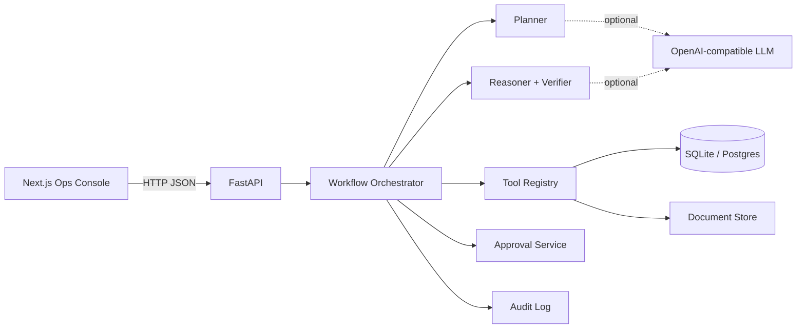

# FinanceOps Agent — Design Document

> **An auditable AI system for finance operations investigation**  
> Deterministic tools do the math. The agent plans and explains. Humans approve anything that mutates the books.

| | |
|---|---|
| **Status** | v0.1 demo / reference implementation |
| **Stack** | FastAPI · SQLAlchemy · Next.js · optional OpenAI-compatible LLM |
| **Safety model** | Tool-grounded answers + human-in-the-loop mutations + full audit trail |
| **Eval highlight** | Recon precision **0.93** · recall **0.87** · tool-selection **100%** · unsupported-claim rate **0%** on benchmark |

---

## 1. Why this exists

Finance teams do not need another chatbot that invents a cash gap.

They need a system that can answer:

> *Why is August cash $82,000 higher in the bank than in the general ledger?*

…and then **prove** the answer with:

1. bank lines that have no GL match  
2. GL cash lines that never cleared the bank  
3. arithmetic that reconciles to the gap  
4. supporting memos/policies  
5. a proposed adjusting entry that **does nothing** until a controller approves it  

**FinanceOps Agent** is built around that contract.

---

## 2. Design thesis

```text
LLM  →  understand, plan, narrate
Tools →  query, match, calculate, detect
Human →  approve sensitive actions
Audit →  make every step reconstructible
```

This is deliberately **not** an unconstrained multi-agent swarm.  
Autonomy without ledger grounding is a liability in finance.

The agent is a **controlled workflow**:

```text
User Request
    │
    ▼
 Planner  ─────────────────────────────►  intent + ordered tool plan
    │
    ▼
 Tool Executor  ───────────────────────►  SQL / recon / variance / docs
    │
    ▼
 Evidence Store  ──────────────────────►  records + calculations accessed
    │
    ▼
 Reasoner  ────────────────────────────►  explanation (tool-grounded)
    │
    ▼
 Verifier  ────────────────────────────►  flag unsupported $ claims
    │
    ▼
 Approval Gate (if mutating)  ─────────►  pending until human decision
    │
    ▼
 Final Response + Audit Trail
```

---

## 3. Product surface

### What a user can do

| Workspace | Job |
|-----------|-----|
| **Investigate** | Ask natural-language finance questions; inspect plan, tools, verification |
| **Reconciliation** | Run bank↔ledger matching; browse matched / probable / unmatched / review |
| **Anomalies** | Run interpretable detectors; review severity-ranked findings |
| **Approvals** | Approve or reject reconcile marks and adjusting JE proposals |
| **Audit trail** | Reconstruct any workflow event-by-event |
| **Records** | Browse bank txns, invoices, and supporting documents |

### Example investigations the system is designed for

- Why does the August bank balance not match the GL?  
- Which invoices are unreconciled?  
- Find suspicious or unusual journal entries.  
- Explain the largest MoM expense variances.  
- Identify transactions that may need manual review.  
- Prepare a month-end variance summary.  
- Reconcile bank activity against invoices and ledger cash.

---

## 4. System architecture



### Repository layout

```text
backend/
  app/
    agent/        # planner, workflow, reasoner
    tools/        # deterministic finance tools
    services/     # approvals + audit
    models/       # SQLAlchemy schema
    api/          # REST surface
    scripts/      # synthetic data seed
  eval/           # objective benchmark harness
  tests/
frontend/         # Next.js TypeScript console
docs/             # architecture + this design doc
```

### Runtime defaults

| Concern | Choice | Rationale |
|---------|--------|-----------|
| Local DB | SQLite | Zero-friction demo; Postgres via `DATABASE_URL` |
| LLM | Off by default | Demo must work without secrets; enable with `LLM_ENABLED` |
| Agent framework | Explicit Python workflow | Prefer clarity over LangGraph ceremony for v1 |
| UI kit | Lightweight custom primitives | Fast to ship; shadcn-ready patterns (`cva`/`clsx`) |

---

## 5. Data model (synthetic but realistic)

The seed builds a three-month operating company ledger (**2024-06 → 2024-08**) with known ground truth.

### Core entities

| Entity | Purpose |
|--------|---------|
| `vendors` / `customers` | Counterparties for AP/AR and anomaly “unusual vendor” rules |
| `accounts` | Chart of accounts incl. Operating Cash `1000` |
| `invoices` | Payables + receivables with document links |
| `journal_entries` + `journal_lines` | Double-entry GL |
| `bank_transactions` | Bank feed with reconciliation status |
| `account_balances` | Period balances + budgets for variance |
| `documents` | Policies, invoices, recon memos (keyword-retrievable) |
| `anomaly_flags` | Detector output + ground-truth seeds |
| `reconciliation_results` | Persisted match runs |
| `approval_requests` | HITL queue |
| `audit_logs` / `workflow_runs` | Observability + reconstruction |

### The August $82k narrative (ground truth)

Bank − ledger cash movement is engineered to ≈ **$82,000** via three timing items:

| Component | Amount | Nature |
|-----------|--------|--------|
| Canyon Software deposit in transit | **+$45,000** | In bank, not in GL |
| Outstanding check CHK-88421 (Northwind) | **+$22,000** | In GL, not cleared by bank |
| Apex late ACH receipt | **+$15,000** | In bank, not in GL |
| **Total** | **$82,000** | Explains the classic gap question |

Additional seeded risks for anomaly eval:

- Weekend **$100,000** wire to an unexpected vendor  
- Duplicate invoice (same vendor/amount within 7 days)  
- Marketing expense MoM spike (Jul $22k → Aug $48k)

Ground truth is written to `backend/data/ground_truth.json` at seed time.

---

## 6. Tooling contract

The LLM never “does finance.” It may only **select and narrate** tools.

| Tool | Deterministic behavior |
|------|------------------------|
| `query_ledger` | Filter journal lines by account/period/reference |
| `search_transactions` | Bank feed search by text/period/amount/status |
| `retrieve_invoice` | Invoice lookup; optional unreconciled filter |
| `search_documents` | Keyword retrieval over memos/policies/invoices |
| `get_account_balances` | Period balances + budgets |
| `reconcile_transactions` | Score and categorize bank↔GL/invoice matches |
| `detect_duplicates` | Vendor+amount near-duplicate pairs |
| `detect_anomalies` | Rules + z-score + MoM spike rules |
| `calculate_variance` | Ranked MoM / budget drivers |
| `compare_periods` | Account-level period diffs |

Every tool returns a structured `ToolResult`:

```text
ok · summary · data · records_accessed · calculations
```

Those fields feed the **audit trail** and the **unsupported-claim verifier**.

---

## 7. Reconciliation algorithm

Matching is scored, not guessed.

### Features

1. **Amount** — exact / near / loose tolerances  
2. **Date window** — same day preferred; configurable day band  
3. **Reference** — invoice/PO/check IDs in bank memo  
4. **Fuzzy counterparty** — normalized name similarity (`SequenceMatcher`)  
5. **Direction** — deposits ↔ cash debits; withdrawals ↔ cash credits  

### Categories

| Category | Meaning |
|----------|---------|
| `matched` | High-confidence auto-match |
| `probable` | Likely match; controller should glance |
| `needs_review` | Risk flags (weekend / large round wire) or mid score |
| `unmatched` | Bank item with no acceptable candidate |
| `unmatched_gl` | Cash GL line with no bank clear (e.g. outstanding check) |

### Output that matters to controllers

- Match table with scores + reasons  
- `bank_total`, `ledger_cash_net`, **`bank_minus_ledger`**  
- Unmatched GL outstanding items  

This is the difference between “AI said it’s timing” and “here are the three lines that sum to the gap.”

---

## 8. Anomaly detection philosophy

Start with **interpretable rules**. Add ML only when it beats a transparent baseline.

Current detectors:

| Rule | Signal |
|------|--------|
| Weekend entry | Bank or JE on Sat/Sun |
| Unusual vendor | `unknown` category or large unknown counterparty |
| Rounded amount | Large exact thousands/ten-thousands |
| Unusual amount | Period z-score ≥ threshold |
| Duplicate invoice | Same vendor+amount within 7 days |
| Expense spike | MoM ≥ 50% and absolute Δ ≥ $5k |

Severity is explicit (`high` / `medium`) so the UI can triage without a black box score-only dump.

---

## 9. Agent planning

### Deterministic planner (default)

Regex + keyword routing maps questions → intents:

- reconciliation  
- variance_analysis  
- anomaly_detection  
- invoice_review  
- month_end_summary  
- journal_review  
- general_investigation  

Each intent expands to an **ordered tool plan** with period extraction (`August` → `2024-08`).

### Optional LLM planner

When `LLM_ENABLED=true` and an API key is present, the planner may emit JSON tool plans.  
On failure, the system **falls back** to deterministic planning. Demo never hard-depends on a model vendor.

---

## 10. Explanation + verification

### Reasoner

Builds markdown from tool payloads:

- reconciliation gap + unmatched components  
- top variance drivers  
- anomaly list  
- document snippets  

Optional LLM narration is allowed, but the default path is deterministic so demos stay reproducible.

### Verifier (anti-hallucination)

Extracts dollar amounts from the answer and checks them against:

- tool `calculations[]`  
- numeric literals present in tool result JSON  

Material unsupported amounts raise `unsupported_claim_rate`.  
This is a first-class evaluation metric — not a nice-to-have.

---

## 11. Human-in-the-loop model

### Sensitive actions (never auto-execute)

- `mark_reconciled` / `approve_match`  
- `create_adjustment` / `propose_journal_entry`  

### Lifecycle

```text
pending → approved | rejected → executed | failed
```

### Example policy in the demo

Asking about the $82k gap proposes booking unrecorded receipts (**$60k** cash debit vs AR), but posts **nothing** until Approvals → Approve.

That is the product’s safety story in one click path.

---

## 12. Observability & auditability

For each workflow the system persists:

| Event | Content |
|-------|---------|
| `user_request` | Raw question |
| `plan` | Intent, steps, rationale |
| `tool_call` / `tool_result` | Args + summary + duration |
| `evidence` | Record/calculation counts |
| `reasoning` | Explanation mode |
| `verification` | Unsupported-claim check |
| `approval_proposed` / `approval_decision` | HITL state changes |
| `final_response` | Answer + latency |

Structured logs use **structlog JSON** for machine consumption; the UI audit page is for humans.

---

## 13. Evaluation methodology

Objective eval requires **known labels**. The seed writes them; `python -m eval.run_eval` measures:

| Metric | Latest demo run |
|--------|-----------------|
| Reconciliation precision | **0.9286** |
| Reconciliation recall | **0.8667** |
| Gap abs error | **$0.50** (calculation accuracy ✔) |
| Anomaly ground-truth type recall | **1.0** |
| Tool-selection accuracy | **1.0** |
| Task-completion rate | **1.0** |
| Avg unsupported-claim rate | **0.0** |
| Avg latency | **~69 ms** (deterministic path) |
| Avg LLM cost | **$0.00** (LLM off) |

Automated tests (`pytest`) cover gap magnitude, precision/recall floors, anomaly presence, variance spike, planner routing, workflow approval proposal, and approval execution.

This is how the project argues it is **engineering**, not a prompt demo.

---

## 14. Security & production posture

### Already in the demo

- No secrets required for local run  
- Parameterized ORM queries (LLM cannot inject raw SQL strings into the DB layer)  
- Mutations gated by explicit human approval  
- Audit of records accessed and actions proposed  
- CORS configurable  

### Production checklist (intentionally out of v1 scope, but designed for)

1. AuthN/Z (SSO) with role separation: investigator vs controller vs admin  
2. Postgres + backups + encryption at rest  
3. Secret manager for LLM keys  
4. PII minimization / field-level access on vendor/bank data  
5. Rate limits + abuse controls on `/ask`  
6. OpenTelemetry traces beside structlog  
7. Prompt/tool version pinning when LLM is enabled  
8. Immutable audit store (WORM / append-only permissions)  
9. Dual control for JE posts above threshold  
10. Model output monitoring on unsupported-claim rate regressions  

---

## 15. UX design principles

The console is an **operations workspace**, not a marketing landing page:

- Brand-first sidebar (`FinanceOps` / `Agent`)  
- Investigate-first workflow with example prompts  
- Evidence panels (tools used, verification) beside the narrative  
- Status chips for match categories and anomaly severity  
- Motion used lightly for hierarchy (`rise` entrance), not decoration  

Visual language: forest/slate greens, Fraunces + DM Sans — professional finance ops, not “AI purple.”

---

## 16. What we deliberately did *not* build

| Temptation | Why we skipped it |
|------------|-------------------|
| Multi-agent debate swarm | Harder to audit; weak ROI for recon math |
| Embedding RAG as day-one dependency | Keyword docs suffice for seeded corpus |
| Full ERP connector | Synthetic data proves the control loop first |
| Auto-posting journals | Unsafe without HITL in this domain |
| Opaque ML anomaly scores only | Controllers need reasons they can defend |

Favor **robust, auditable workflows over flashy autonomy.**

---

## 17. Roadmap (high-signal next increments)

1. **Partial-payment & multi-currency matching**  
2. **Embedding retrieval** for large document corpora  
3. **ERP/bank adapters** behind the same tool interfaces  
4. **Controller workspace** with queue SLAs and maker-checker  
5. **Continuous eval CI** gating precision/recall and unsupported-claim rate  
6. **Optional LangGraph port** once the control graph is stable  

---

## 18. How to run the reference implementation

```bash
# API
cd backend && uv sync
uv run python -m app.scripts.seed
uv run uvicorn app.main:app --host 127.0.0.1 --port 8765

# UI
cd frontend && npm install && npm run dev
# → http://127.0.0.1:3847

# Eval
cd backend && uv run pytest -q && uv run python -m eval.run_eval
```

Or: `docker compose up --build`

---

## 19. One-sentence summary

**FinanceOps Agent shows how to put an LLM next to real financial data without letting it touch the math, mute the audit trail, or bypass human control.**

---

*Document version: 0.1 — accompanies the public reference implementation.*
